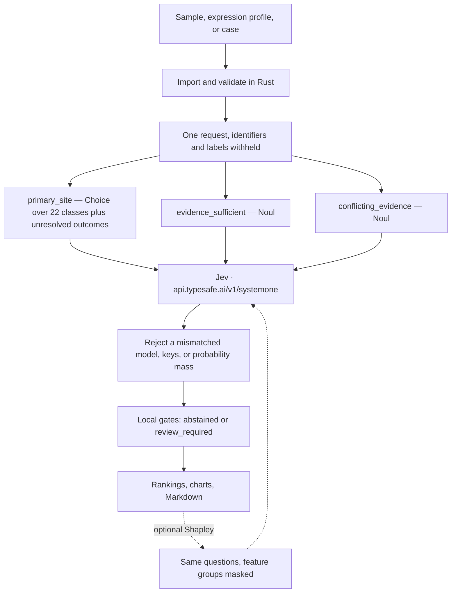

# Jev Onco Statistical Hierarchy (JOSH)

Rust workbench (Ratatui TUI and CLI) for cancer-of-unknown-primary research, version **0.8.0**. It loads molecular, expression, and clinical evidence, asks the hosted model **Jev** (`jev-1.13.0`) for an origin distribution, then checks, gates, charts, and exports the answer locally.

## How Jev is used



The three questions share the evidence and cannot read each other's answers. Rust owns counts, thresholds, reference comparison, cohort statistics, and rendering. A live call accepts declared **synthetic** data, uses `TYPESAFE_API_KEY`, and is sent once after confirmation. Prompt `molecular-origin-v5` is the current molecular request.

| Crate | Role |
| --- | --- |
| `josh-core` | Contracts, prompts, response checks, gates |
| `josh-jev` | HTTPS client |
| `josh-ingest` | File and table import |
| `josh-features` | Mapping, signatures, reference comparison, cohort stats |
| `josh-explain` | Shapley values over a saved run |
| `josh-app` | CLI, TUI, loopback API |

## Start

```bash
./scripts/start
```

Requires Cargo, pinned Rust **1.98.1**, and a C compiler. In the TUI: open a bundled sample, then **Data → Run analysis**. `josh molecular prepare` prints the request without sending it. `josh --help` lists commands.

[Quickstart](docs/QUICKSTART.md) · [User guide](docs/USER_GUIDE.md) · [Jev workflow](docs/references/JEV_WORKFLOW.md)

## Inspiration

The study question follows OncoNPC:

Moon et al., *Machine learning for genetics-based classification and treatment response prediction in cancer of unknown primary*, Nature Medicine 29, 2057–2067 (2023). [doi:10.1038/s41591-023-02482-6](https://doi.org/10.1038/s41591-023-02482-6)

Authors' repository: [itmoon7/onconpc](https://github.com/itmoon7/onconpc)

JOSH is a separate Rust program. It contains no OncoNPC source, weights, or data. Origin inference is Jev. OncoNPC's classifier is XGBoost, and that model is not in this repository.

Licensed under the [MIT License](LICENSE).
