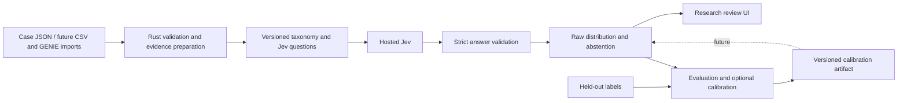

# Architecture and contracts

Status: design plus an implemented first slice. Jev is the sole classifier. Rust owns parsing, numeric transformations, orchestration, validation, storage and review. A hosted model means local GPU hardware is unnecessary for this initial application; large genomics preprocessing has its own resource needs.

## Modules

| Module | Status | Responsibility |
| --- | --- | --- |
| `nexus-core` | Implemented | Typed case/evidence, taxonomy, questions, result contract and abstention |
| `nexus-jev` | Initial adapter implemented | Official endpoint, server-side key, HTTPS, timeouts, bounded response parsing |
| `nexus-app` | CLI/TUI/offline API implemented | File workflows, Ratatui terminal workbench and loopback Axum service |
| `nexus-ingest` | Phase 02 | Versioned CSV/TSV/GENIE mappers and provenance |
| `nexus-eval` | Phase 04 | Cohort runs, metrics, calibration and artifact compatibility |
| `nexus-store` | Phase 05 | PostgreSQL persistence, immutable runs and audit events via SQLx |
| `nexus-web` | Phase 05 | Leptos Rust UI with Axum integration |

Framework references: [Axum](https://docs.rs/axum/0.8.8/axum/), [Reqwest](https://docs.rs/reqwest/0.12.28/reqwest/), [Leptos](https://book.leptos.dev/), [SQLx](https://docs.rs/sqlx/latest/sqlx/). These are stack choices for this project; future modules are not installed or implemented yet.

The current terminal interface uses Ratatui with Crossterm. CLI and TUI share local workflow functions; TUI network work runs asynchronously against a snapshot of the case, with case changes blocked until completion. Reloading evidence clears the displayed result. [Terminal guide](TERMINAL_GUIDE.md)

## Implemented case contract

`fixtures/synthetic-case.json` is the canonical example. Version 1 requires `schema_version`, `case_id`, `data_class`, and `findings`. Optional fields are age, sex at birth and specimen site. Each finding has a unique local ID, kind, name, and value. Unknown JSON fields are rejected. Missing optional fields remain unknown; unknown is never automatically negative.

Limits: 16 KiB serialized case; at most 64 findings; finding names at most 128 bytes; values at most 1,024 bytes; case/finding IDs at most 64 restricted ASCII characters; age 0–120. These are software bounds, not clinical eligibility criteria. The byte budget is an application limit, not an accurate tokenizer. Total Jev prompt-token budgeting is Phase 03 work.

`case_id` and `data_class` are excluded from provider state. Findings are still user-supplied text and may contain identifying information or instructions. The initial adapter enforces a synthetic-data declaration; it does not certify that arbitrary text is synthetic or deidentified. Actual deidentification and source review belong in the ingestion/release workflow.

Version 1 has no free-form report document, raw mutation table, expression matrix or image input. Evidence must already be summarized. It is not a GENIE importer. Source identifiers, assay coverage, genomic coordinates/reference build, measurement units, timepoints and missingness need the versioned extension in Phase 02.

## Model contract

The adapter pins `jev-1.13.0`. A request has one `primary_site` Choice and two independent Noul questions: `evidence_sufficient` and `conflicting_evidence`. They share observations, cannot read each other's answers, and never receive evaluation labels. Question wording, taxonomy and gate constants are centralized in `nexus-core` for review.

The result parser requires the expected model, exact question keys, answer variants, every taxonomy key, finite probabilities in [0,1], total mass within 1e-6 of one, and a chosen option with maximal mass. Malformed distributions are rejected, never repaired or silently renormalized. Add a measured precision tolerance only if provider contract tests show it is necessary.

All returned options remain present when sorted. No top-three renormalization is allowed. Empty findings, low support, conflicts, low top probability, small margin or a no-match winner produce abstention. Passing results are still `review_required`. Invalid provider responses are errors, not successful abstentions. Calibration fields stay null.

Mock inference is deliberately uniform. Replay is for developer fixtures, not authenticated replay of clinical runs. Both force abstention and identify their source. Real replay with an original request/response binding and signed run provenance is future work.

## Provenance

Implemented outputs include requested/resolved pinned model, prompt version, taxonomy version, gate-policy version, exact serialized request SHA-256, usage and local case ID. SHA-256 is a reproducibility fingerprint, not anonymization. Current fingerprints preserve vector order; reordering findings changes the request.

Future persistent runs also need case revision, source checksums, importer/annotation versions, source access terms, reference release, model request timestamp, provider request ID, latency, error/retry history, calibration version and reviewer actions. Store labels in a separate evaluation table inaccessible to request preparation.

## Service behavior and boundaries

The current server exposes `/health`, `/v1/prepare`, and `/v1/demo`. Live use is an explicit CLI operation or a confirmed TUI action and only accepts synthetic data. It uses a 5-second connection timeout, 20-second request timeout, 64 KiB response cap, and no redirects. Errors omit provider bodies and credentials. There are no automatic retries yet; reliability and idempotency are Phase 03 work.

No API key is embedded in a browser bundle. Phase 05 adds auth, storage and queued inference. Phase 06 establishes external deployment readiness. Do not expose this local prototype as a patient-facing service. There is no automated diagnosis, treatment recommendation, or report-signing path in the proposed initial product.

## Proposed persistence model

Use `cases` with immutable `case_revisions`; `source_files` and `findings` for provenance; `classifier_runs` for request and raw response artifacts; `calibration_artifacts` for scoped mappings; `reviews` for annotations; `audit_events` for access and changes. An inference cache key must include tenant, case revision, request hash, model and prompt/taxonomy versions. Cache entries do not cross tenants. Updating evidence invalidates prior review status without deleting past runs.

Keep evaluation labels, reference retrieval partitions and operational case evidence separated by both data model and authorization. A run cannot become a labeled evaluation observation merely because a reviewer agrees with Jev; the ground-truth protocol must specify independent evidence.
