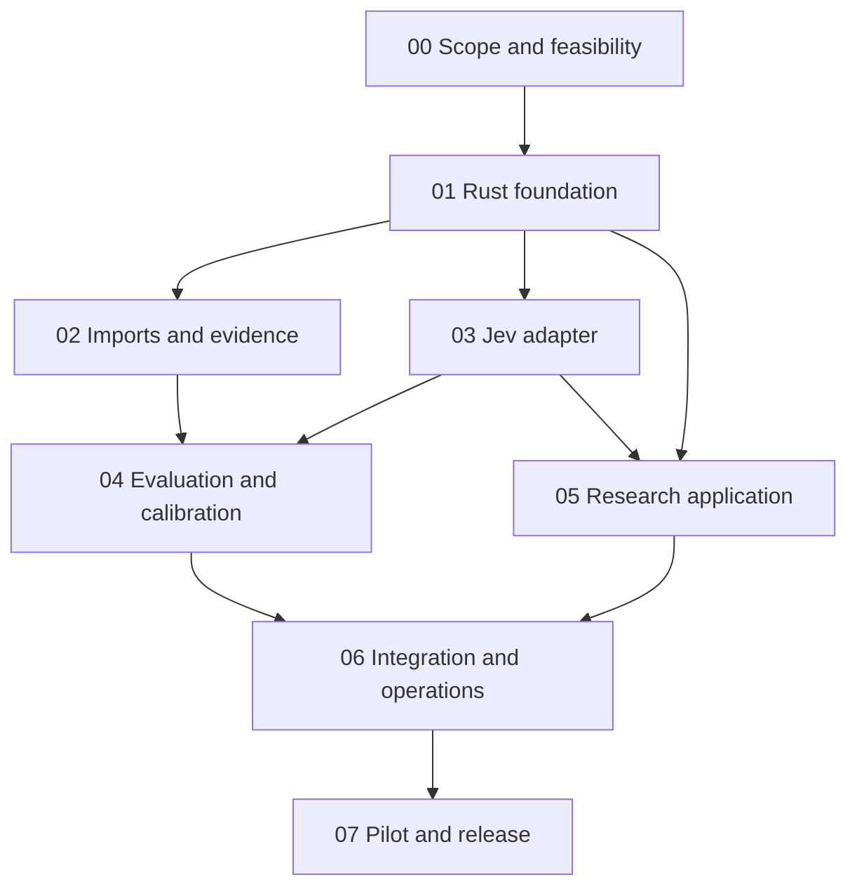

# Developer delivery plan

Version 0.2 — 2026-09-21. Objective: rebuild the useful Open_Nexus workflow in Rust with **Jev as the sole classifier**, ingest case evidence, return ranked origin assignments with explicit probability semantics, and support human research review.

Scope decision: exclude XGBoost implementation and benchmarks, recovery or retraining of the original model weights, and SHAP explanations. These are not dependencies, deliverables or optional tasks. Historical descriptions remain in the source audit only. Evaluation uses labeled cases and deterministic class-frequency references; the application presents source evidence, probabilities and uncertainty.

## Starting point

The audit is complete and an initial Rust slice includes a CLI, interactive TUI and offline HTTP API. CLI and TUI are supported application interfaces throughout the roadmap. No real cohort has been imported, no live Jev request has been verified, and no CUP accuracy claim is supported. This is the delivery plan for completing the application, not a claim that all phases are done. The user's request establishes Jev and Rust; input modality remains a product decision. Current assumption: normalized pathology/IHC/clinical findings first, with a genomic import track that preserves Open_Nexus's original purpose.

## Phase index and estimates

Estimates are planning ranges in **person-days**, assuming experienced developers and timely access to clinical/data reviewers. Waiting for data agreements, cohort curation and external evaluation is excluded. Assign names to the role labels at kickoff; the repository contains no confirmed team roster.

| Phase | Work | Lead | Estimate | Depends on | Current status |
| --- | --- | --- | --- | --- | --- |
| [00](phases/00-scope-and-feasibility.md) | Scope, source audit, taxonomy and scientific feasibility | Technical lead + clinical lead | 3–5 | None | Audit delivered; decisions open |
| [01](phases/01-rust-foundation.md) | Rust domain model, contracts, tooling | Rust backend | 4–7 | 00 scope draft | Initial slice delivered |
| [02](phases/02-data-import-and-evidence.md) | Case imports, provenance, cohort preparation | Data engineer + clinical curator | 8–15 | 00, 01 contracts | Planned |
| [03](phases/03-jev-classifier.md) | Jev integration, prompts, taxonomy, reliability | Rust backend + ML engineer | 6–10 | 01; 02 fixtures for acceptance | Initial adapter delivered |
| [04](phases/04-evaluation-and-calibration.md) | Jev evaluation, calibration, abstention validation | ML/statistics lead | 10–20 | 02, 03 and labeled cohort | Planned |
| [05](phases/05-research-application.md) | Rust web UI, persistence, review workflows | Rust frontend + backend | 10–18 | 01, 03; 04 before calibrated UI | Planned |
| [06](phases/06-integration-and-operations.md) | Integration, privacy, reliability and deployment | Platform + QA | 7–12 | 02–05 | Planned |
| [07](phases/07-pilot-and-release.md) | Blinded research pilot and release decision | Clinical lead + QA + product | 8–15 | 04–06 | Planned |

Total indicative effort: 56–102 person-days. This is not a promised calendar duration or a clinical-validation estimate. First usable developer demo is already present; scientific usefulness depends on the cohort and evaluation results.

## Dependency sequence

Data engineering and adapter hardening can proceed independently once the case contract is agreed. UI work can use clearly marked mocks. Real-data external requests wait for the applicable data/provider terms; calibrated displays wait for Phase 04 evidence. A scientifically negative result is a valid Phase 04 outcome and must change the release scope.

## Team ownership

| Role | Owns | Required handoff |
| --- | --- | --- |
| Technical lead | Architecture, dependency decisions, release scope | Reviewed contracts and decision records |
| Rust backend engineer | API, Jev client, storage and orchestration | Contract tests and operational interfaces |
| Data engineer/bioinformatician | Imports, identifiers, assay coverage, numeric preprocessing | Data dictionary, quality report and fixtures |
| ML engineer/statistician | Evaluation splits, metrics, calibration, drift | Versioned report and acceptance recommendation |
| Clinical/pathology reviewer | Eligible population, taxonomy, evidence interpretation, ground truth | Signed review artifacts and adjudication rules |
| Rust frontend engineer | Leptos interface and accessible review experience | End-to-end reviewer workflow |
| QA/platform engineer | Failure cases, deployment, access, recovery | Reproducible release evidence |

These are work packages for the human development team, not additional agents launched during this session.

## Build and resource requirements

Start with Rust/Cargo, a C compiler, Git and network access for dependencies. A typical developer machine with 4 CPU cores and 8 GiB RAM should be a reasonable initial budget for the API/CLI; measure actual needs. Jev inference runs at the provider, so a local inference GPU is not a prerequisite. Later infrastructure adds PostgreSQL, controlled artifact storage, an identity provider, and Leptos/WASM build tooling. Large GENIE processing needs measured memory/disk capacity and streaming imports rather than an assumed fixed machine size.

For live testing: a TypeSafe account/key, outbound HTTPS, an explicit run budget, a pinned model and approved input policy. At the observed direct price of $0.042/M input tokens, 10,000 cases averaging 5,000 billed input tokens would cost about $2.10 in model input charges alone. This is an illustrative calculation; count actual token usage and include repeated prompts, retries, calibration runs, storage and people time. [Dated provider pricing](https://docs.typesafe.ai/models)

## Decisions to close

1. First target cohort and modalities: structured pathology/IHC, genomic-only, or both; do not conflate their evaluation results.
2. Intended use: retrospective research first, who reviews results, and what evidence establishes ground truth.
3. Origin taxonomy, rare/uncovered groups, eligibility, and handling multiple primaries.
4. Dataset access, permitted off-site processing and provider handling terms.
5. Measured scientific success criteria, release operating point, and minimum coverage.
6. Distribution/license choice and provenance for any reused data-processing code, reference material or datasets.

## Definition of done

A phase is complete only when its deliverables and acceptance evidence are attached, tests pass, and its named reviewers accept the result. Keep implementation and scientific validation separate. An API that returns JSON is not evidence that cancer predictions are correct. Every classifier version binds case schema, preprocessing, taxonomy, prompt, model and optional calibration artifact; changing any of these triggers the relevant regression evaluation.

No phase includes autonomous treatment selection. Any later clinical deployment requires its own intended-use, evidence and release process; the present plan delivers a research application.
