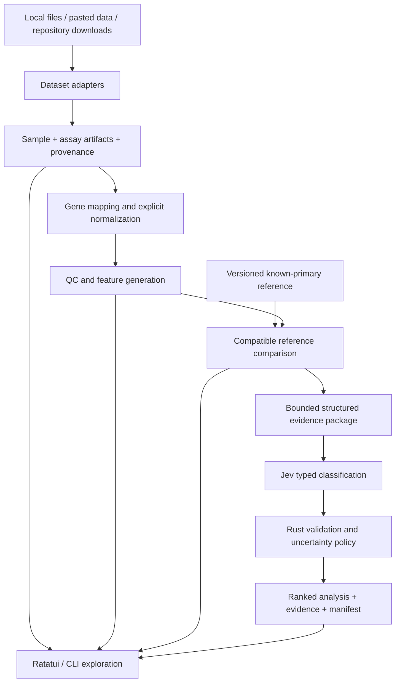

# JOSH data-first redesign: gap assessment

Assessment date: 2026-09-22. Baseline: application 0.4.0, commit
`757692e0526605411984e5fd271a7acec1156011`. Requirements: the design team's
34-section **JOSH CUP Platform — Data-First Application Redesign Specification**
provided by the project owner. This document assesses the implementation and
proposes changes; it does not claim the redesign has been implemented.

Fixed requirements: **Rust application and scientific processing, Jev as the
classifier, Ratatui as the primary interactive interface, and a supported CLI.**
At this historical baseline, XGBoost, original weights and SHAP were excluded.
The approved [September 23 plan](../redesign/04-onconpc-jev-explanations.md)
supersedes the SHAP exclusion with Rust model-agnostic Jev explanations.

## Assessment

JOSH has a reusable engineering foundation, but does not yet implement the proposed
molecular data workbench. Its central object is a small `Case` containing summarized
text findings. Application 0.4.0 expanded clinical context, NICE guidance and review
history before implementing expression data, canonical genes or reference cancers.

The main refactor is **data model and scientific pipeline first**, followed by the
Jev evidence contract and terminal workflows. Renaming `Case` to `Sample`, adding
upload buttons, or expanding the prompt would not close these gaps.

Important distinctions established by inspection:

- Demographics and patient identifiers are already optional. JOSH does not require
  a complete patient profile today; this is not a missing feature to invent.
- CSV/TSV support means JOSH's own normalized finding table, not arbitrary cancer
  datasets. A two-column `gene / expression` TSV is rejected.
- The current `Pathway` chart is the clinical MUO → provisional CUP → confirmed CUP
  pathway. It is not molecular pathway scoring.
- A taxonomy of cancer names is present. A reference dataset, reference feature
  profiles and numerical sample-to-reference comparisons are not.
- Structured Jev requests, rankings and abstention exist. Evidence attribution,
  modality-specific disagreement and reference-based out-of-distribution assessment
  do not.
- Batch import and case browsing exist. Cohort inference, clustering and dataset
  exploration do not.
- Source hashes and request fingerprints exist. They are not a complete archived,
  reproducible scientific analysis.

## Evidence and scope of verification

| Evidence | What it establishes |
| --- | --- |
| [Domain types](../../crates/josh-core/src/domain.rs): `Case`, `Finding`, `CaseMetadata` | `case_id` is required; `sample_id` is optional metadata; four broad evidence kinds; values are strings; maximum 64 findings and 16 KiB per case |
| [Tabular parser](../../crates/josh-ingest/src/tabular.rs): `REQUIRED`, `parse` | Required columns are `case_id,data_class,finding_id,kind,name,value`; units are recorded without numerical normalization |
| [Import types](../../crates/josh-ingest/src/types.rs) and [importer](../../crates/josh-ingest/src/ingest.rs) | Four explicit file formats; bounded import, validation, label sidecars and group partitions; no source adapter interface or matrix reader |
| [Prompt](../../crates/josh-core/src/prompt.rs): `prepare` | Jev sees findings and optional demographic/specimen context; no computed reference similarities or molecular feature package |
| [Provider contract](../../crates/josh-core/src/provider.rs), [policy](../../crates/josh-core/src/policy.rs), [client](../../crates/josh-jev/src/lib.rs) | Typed Choice/Noul output; strict distribution checks; engineering abstention thresholds; live inputs restricted to declared synthetic cases |
| [TUI](../../crates/josh-app/src/tui.rs) and [visualizations](../../crates/josh-app/src/tui/visuals.rs) | Default clinical example; eight tabs including NICE Guidance and Clinical Review; reusable score/IHC rendering |
| [CLI](../../crates/josh-app/src/main.rs) and [API](../../crates/josh-app/src/lib.rs) | JSON/text exports, local file import, individual synthetic inference, offline API; no sample/dataset/reference services |
| [Build status](../BUILD_STATUS.md), [data inventory](../data/inventory.md), [existing plan](../PLAN.md) | Previously recorded 100 tests; no real cohort/reference or completed Jev cancer evaluation; RNA currently deferred in the old plan |

Offline checks performed during this assessment against the available `josh 0.4.0`
binary:

1. `josh --version` reported `josh 0.4.0`.
2. `josh validate -` accepted the synthetic fixture with age, sex and specimen-site
   fields removed: exit 0, four findings.
3. Importing an invented two-column expression TSV returned exit 1 and
   `invalid_import_columns`.

Source inspection is the basis of the coverage assessment. The full Rust test suite
was not rerun for these documentation changes. No Jev request or real-data import
was performed. Existing test counts are historical build evidence, not new test
results or evidence of tissue-of-origin performance.

## Coverage of all specification sections

`Partial` means related infrastructure exists, not that the requirement is complete.
`Missing` means no implementation of the requested capability was found. Phase
references below refer to the new redesign plans, not the old numbered roadmap.

| Spec | Requirement | Current coverage | Required change / delivery |
| --- | --- | --- | --- |
| 1 | Data-first product philosophy | Partial; research language, but case/clinical orientation | Make sample/dataset workflows the default; Phase 1 |
| 2 | Visible import-to-result pipeline | Partial; separate import, prepare and classify operations | Explicit stage state, QC stops, comparison and run history; Phase 1 |
| 3 | Sample is the primary object | Partial; optional sample ID inside Case | Independent Sample and Dataset entities; Phase 1 |
| 4 | Expression, somatic variants and structured IHC | Partial only for summarized IHC/molecular text | Expression in Phase 1; variants and richer IHC in Phase 2 |
| 5 | Extensible secondary modalities | Missing typed modality contracts | Artifact-backed extension contract in Phase 1; implementations in Phase 3 |
| 6 | Files, paste and repository import | Partial; local canonical files/stdin only | Detection, mapping preview and paste in Phase 1; VCF/MAF in Phase 2; repository connectors in Phase 3 |
| 7 | Source-independent canonical representation | Partial; small finding-oriented Case | Sample, assay and modality schemas with raw/derived separation; Phase 1 |
| 8 | Complete dataset/feature provenance | Partial; source hash, record/field and some assay metadata | Dataset/study/accession, processing, timestamps, source artifacts and transformation lineage; Phase 1 |
| 9 | Known-primary reference cancers | Missing; taxonomy is not a reference cohort | Versioned, labeled, compatible reference release and comparison engine; Phase 1 |
| 10 | Machine-readable multimodal feature space | Missing numerical feature engine | Typed features and availability masks; expression first, combinations in Phase 2 |
| 11 | Jev consumes structured computed evidence | Partial; structured summarized findings | Versioned EvidencePackage with reference measurements, QC and evidence IDs; Phase 1 |
| 12 | Structured prediction/evidence output | Partial; rankings and scalar gates | AnalysisResult assembled in Rust, including linked evidence, conflicts and missing modalities; Phases 1–2 |
| 13 | Ranked tissue-of-origin results | Partial; raw assignment bars already exist | Show reference similarity separately from Jev scores; Phase 1 |
| 14 | Inspectable evidence supporting rankings | Partial; source findings visible, no per-ranking linkage | Computed evidence records and feature/source drill-down; Phases 1–2 |
| 15 | Explicit conflicting signals | Partial; single Jev conflict number | Modality comparisons and source-linked conflict records; Phase 2 |
| 16 | UNKNOWN / out-of-distribution | Partial; abstention and no-match options | Distinct insufficiency, incompatibility, unsupported origin and measured OOD states; Phase 1 onward |
| 17 | Molecular QC before inference | Partial; import validity/missingness only | Mapping, distribution, feature overlap and assay-specific QC; Phases 1–2 |
| 18 | Exploration without prediction | Partial; raw findings can be read | Gene search, distributions, reference percentiles and molecular pathways; Phases 1–2 |
| 19 | Cohort analysis | Partial; batch import/browser, no batch inference | Cohort membership in Phase 1; queued inference, groups and clustering in Phase 2 |
| 20 | Dataset explorer | Missing | Dataset inventory, sample table, modality/missingness/citation views; Phase 1 |
| 21 | Automatic data dictionary | Partial; hand-written table guide and JSON Schemas | Dataset-specific fields, units, mappings, missingness and origins; Phase 1 |
| 22 | Dataset adapter architecture | Missing; direct format dispatch | Detection/parse/normalize/validate interface with source-specific adapters; Phases 1–3 |
| 23 | Canonical gene mapping | Missing | Versioned HGNC/Ensembl/Entrez mapping service; Phase 1 |
| 24 | Modality-aware expression normalization | Missing; units are strings | Immutable raw values, explicit transformations and compatible-reference checks; Phase 1 |
| 25 | Separation of data and model | Partial; four crates, but Case flows straight into prompt | Feature/reference/pipeline boundaries shared by CLI, TUI and API; Phase 1 |
| 26 | Reproducible analysis manifest | Partial; source/case/request hashes | Complete artifact/version graph and archived provider exchange; Phase 1 |
| 27 | JSON, CSV, TSV and PDF export | Partial; JSON/text only | Full JSON and tabular exports in Phase 1; PDF report in Phase 2 |
| 28 | Samples/Datasets/Analyze/Explore/Models/Reference/Projects | Missing proposed navigation | Ratatui navigation, with Models showing Jev/configuration versions; Phase 1 |
| 29 | Sample dashboard | Partial; evidence/result/import panels separated | One sample view with modalities, QC, provenance, reference compatibility and run action; Phase 1 |
| 30 | Research-first terminology | Largely present | Preserve; move diagnostic guidance out of primary navigation and distinguish score semantics |
| 31 | Expression-first minimum viable refactor | Not aligned; old plan defers RNA | Replace delivery priorities with three linked redesign phase files |
| 32 | Reference architecture | Partial; Jev and terminal shell exist | Implement normalization, feature engine, reference comparison and evidence packaging |
| 33 | Schema before UI | Partial; typed contracts exist but remain case-oriented | Define new domain/contracts before new screens and storage migrations |
| 34 | End-to-end acceptance | Not met for the target molecular workflow | Use the acceptance mapping below; no completion percentage inferred |

## Keep, remove from the primary product, and replace

### Keep and extend

- Rust workspace, Serde/Schemars contracts, Clap CLI, Tokio/Reqwest provider client,
  Ratatui/Crossterm interface and shared workflow services.
- Strict validation, source snapshots/checksums, non-overwriting exports, structured
  errors, label isolation, group-aware partitions and invalidation of stale results.
- Distinctions among observed, negative, unknown and not tested. Missing modalities
  must remain explicit; zero expression is not a missing value.
- Jev version pinning, request preview, complete raw distributions, visible mock
  labels, null unvalidated calibration and abstention behavior.
- Existing score bars, IHC table, theme, keyboard handling and terminal restoration.
  Reuse widgets against the new domain model.

### Remove from the default workflow; retain compatibility

| Current component | Proposed disposition | Code/doc impact |
| --- | --- | --- |
| Clinical example at TUI startup | Open a project/sample dataset or molecular example | `tui.rs`, fixtures, README and terminal guide |
| NICE Guidance / Clinical Review tabs | Remove from primary navigation; preserve legacy review records as optional attachments | `tui.rs`, `tui/guidance_view.rs`, clinical guide |
| Clinical stage pathway and investigation timeline | Replace primary views with data-processing progress and analysis history | `tui/visuals.rs`; do not describe these charts as molecular pathways |
| NICE rules embedded in core domain | Isolate behind a legacy/optional boundary; no dependency from sample analysis | `clinical.rs`, `guidance.rs`, legacy schemas/tests and API |
| Clinical review as a required next action | Use analysis/QC/conflict states; optional research annotation remains useful | Result presentation and workflow services |
| Browser/Leptos delivery as the next main UI milestone | Defer; Ratatui and CLI deliver the workbench first | Existing Phase 05 and frontend role description |
| Old assumption of pathology/IHC/clinical inputs first, RNA later | Supersede with expression-first delivery | PLAN, intended use, architecture and old Phase 02 |

This recommendation is not a request to erase historical cases, reviewed notes or
tests. Preserve v1–v3 readers, fixtures and old request/result version semantics;
deprecate entry points deliberately. No application component is removed by this
assessment. XGBoost, original weights and SHAP are already absent from the runtime
and stay outside the new plan.

### Replace structural assumptions

1. **`Case` as the main aggregate:** introduce `Sample` with a required stable sample
   identity. Study, dataset, assay, aliquot and optional patient-group identity are
   separate concepts. A single sample may have multiple assays/timepoints without
   merging different specimens into one molecular vector.
2. **Every datum is a `Finding { name, value: String }`:** add typed expression,
   variant and IHC structures plus modality artifacts. Preserve original strings
   for provenance, but validate numerical measurements as numbers with units.
3. **64 findings / 16 KiB describes a sample:** keep bounded request envelopes, but
   store large matrices/variant tables separately with checksums and streaming
   readers. Do not send a whole transcriptome to Jev or silently truncate it.
4. **Import always prepares a Jev request:** ingestion and exploration must succeed
   independently of inference readiness, API credentials and provider budgets.
5. **Hard-coded CSV columns and manual format selection:** introduce detection and
   explicit correction of delimiter, orientation, sample/gene columns and units.
   Unknown metadata stays unknown; detection is a proposal, not a scientific fact.
6. **Small demo taxonomy:** introduce a versioned, reference-linked cancer ontology.
   Broad sites and subtypes require explicit mappings; avoid overlapping categories
   in a single mutually exclusive Choice distribution.
7. **One conflict number / one abstention status:** add local QC and reference
   assessments with evidence IDs, plus Jev's independent judgments. A successful
   HTTP response does not establish that a sample is represented by the reference.
8. **Case-based API and proposed database:** introduce sample revisions, datasets,
   immutable artifacts, reference releases and analysis runs before UI or tables
   are expanded. Retain old routes only as documented compatibility paths.

## Proposed Rust architecture

Reference comparison must happen **before** Jev when those similarities are input
evidence. This resolves the ordering mismatch between the specification's initial
workflow and its structured Jev example.

Rust owns orchestration and calculations; Jev owns the final structured origin
judgment. Deterministic correlations, distances, cohort summaries and QC are
scientific preprocessing/comparison, not a replacement classifier. Do not add a
second trained tissue-of-origin classifier to satisfy the diagram's `MODEL` box.

| Logical module | Responsibility |
| --- | --- |
| `josh-core` | Sample/dataset/modality contracts, artifact IDs, provenance, result and uncertainty types; legacy Case reader separated |
| `josh-ingest` | `DatasetAdapter` lifecycle; bounded detection/parsing; joins; raw source retention and data dictionaries |
| `josh-features` (new boundary) | Gene mapping, numerical transformations, feature vectors, QC and versioned molecular gene-set calculations |
| `josh-reference` (new boundary) | Reference releases, eligibility/compatibility, comparison measurements, reference percentiles and OOD inputs |
| `josh-jev` | EvidencePackage → versioned questions → validated provider outputs; transport hardening |
| `josh-pipeline` (new boundary) | Stage state, analysis manifests, artifact reuse, invalidation, jobs and replay |
| `josh-app` | Ratatui and CLI views over shared services; optional local API; no source-format logic in widgets |

These are responsibility boundaries; new crates should be created when the first
implementation needs them. The early application can use local manifests and an
artifact store without waiting for PostgreSQL or a browser interface.

### Canonical data and provenance

Define contracts for `Project`, `Dataset`, `Sample`, `Assay`, `ModalityArtifact`,
`GeneIdentity`, `Transformation`, `QcReport`, `FeatureSet`, `ReferenceRelease`,
`EvidencePackage`, `AnalysisRun` and `AnalysisResult`.

A Sample references immutable raw and derived artifacts rather than embedding every
matrix cell in JSON. Each assay records modality, units/scale, platform, organism,
genome/annotation when applicable, processing method and source. Model readiness is
a per-modality/per-reference assessment, not just a checkbox that a file exists.

Keep source dataset, study, accession, original sample/aliquot ID, source filename,
checksum, acquisition/import time, row/column/record location, processing and
normalization versions, and transformations. A feature must resolve back to its
source measurements. Corrections produce revisions rather than rewriting raw data.

Known-primary labels belong to reference/evaluation annotations with explicit use
roles. Query ground truth must not enter Jev state. Labeled reference summaries are
legitimate evidence; query labels and revealing identifiers are not. Group known
patient-linked samples together for reference/development/calibration/test separation;
missing patient identity must not prevent import, but requires a conservative
evaluation assignment. Never turn a Jev prediction into reference truth automatically.

### Gene mapping, normalization and reference construction

- Centralize mappings using a pinned downloadable authority release; preserve the
  original identifier, mapping version, match type and ambiguities. Prefer a stable
  HGNC ID internally with its approved symbol for display. Versioned Ensembl IDs,
  previous symbols, aliases, unmapped genes and many-to-one mappings need explicit
  outcomes. HGNC publishes downloadable and archived data suitable for pinning;
  the exact mapping fields must be checked for the selected release.
  [HGNC downloads](https://www.genenames.org/download/)
- Begin with bulk, gene-level human expression. Accept raw counts, TPM, FPKM,
  explicitly normalized matrices and labeled microarray-derived values into typed
  storage. Enable inference only for a tested compatible pipeline/reference pair.
  Unclassified units or unsupported platform processing may still be explored.
- Store raw, normalized and model-input values separately. Record every transform,
  parameters and fitted reference. Do not assume counts are TPM, infer units from
  numeric ranges, double-log data, replace missing genes with measured zero, or
  apply one normalization rule to every modality. Counts-to-TPM requires appropriate
  length/assay information. GDC distinguishes STAR counts, FPKM, FPKM-UQ and TPM in
  its processing documentation; these are different representations.
  [GDC mRNA pipeline](https://docs.gdc.cancer.gov/Data/Bioinformatics_Pipelines/Expression_mRNA_Pipeline/)
- Build an initial known-primary reference from one compatible, curated processing
  family, with exact sample selection, disease labels, feature order, transform,
  class counts and artifact hashes. A local GDC-derived export can precede a network
  GDC connector. Do not pretend a few synthetic centroids are a cancer reference.
- Evaluate candidate similarity methods such as rank correlation or standardized
  distance on development data; freeze the chosen method and thresholds before
  testing. Their values are similarities/distances, not posterior probabilities.
  Feature selection, scaling and batch correction must not fit on the held-out
  queries. Test platform/study shift rather than assuming TPM makes cohorts comparable.
- Use external known-primary cohorts for validation. True CUP can form an external
  descriptive/evaluation cohort, with accuracy measured only where an independent
  origin standard exists. An accession in an example is not evidence of cohort
  contents, suitability or permission.

### Jev integration: what the provider can and cannot supply

The provider documentation describes typed **Choice**, **Score** and **Noul**
decisions, not generated narrative explanations. Rust must construct the requested
application JSON around those answers and source-linked computed evidence.
[Jev capabilities](https://docs.typesafe.ai/introduction/coding-agents)

Use structured state containing QC, measured reference comparisons, modality
availability and bounded molecular observations. Ask one origin Choice and separate
sufficiency/conflict questions. Questions in a request are independent; if a later
judgment needs an earlier answer, orchestrate a separate request and archive the
dependency. Evidence selection, if added, should operate on existing evidence IDs
and be tested; selected evidence is not a causal explanation of the model.
[TypeSafe primitives](https://docs.typesafe.ai/primitives)

As checked on the assessment date, TypeSafe lists `jev-1.13.0`, text/JSON input,
64k tokens per request and 32k for state plus the longest question. It documents no
customer fine-tuning/LoRA. Preserve version pinning, budget the entire request and
verify token counting; the current 64 KiB application bound is not a token count.
Importing reference data therefore builds JOSH's comparison assets and request
context, not custom Jev weights. Recheck limits when implementing/upgrading.
[TypeSafe models](https://docs.typesafe.ai/models)

No source inspected establishes validated CUP performance for this combination.
Separate these quantities in contracts, exports and charts:

| Quantity | Meaning |
| --- | --- |
| `reference_similarity` | Named local comparison method on compatible features; include scale and overlap |
| `jev_raw_probability` | Jev distribution across the exact supplied assignment options |
| `provider_confidence` | Distribution concentration supplied by Jev; not a second cancer probability |
| `calibrated_probability` | Null until an independently evaluated, compatible calibration artifact exists |
| `support_status` / `unknown_reason` | Local QC/reference status plus explicitly versioned inference policy |

The provider documents confidence separately from the option probabilities.
[Confidence semantics](https://docs.typesafe.ai/confidence)

Do not display a correlation of 0.82 as an 82% chance of lung cancer, normalize
independent modality similarities into probabilities, or relabel current raw Jev
bars as measured reference similarity. Preserve no-match mass and keep operational
states distinct from biological labels. An OOD detector requires reference coverage
and held-out rejection evaluation; a low Jev score alone is not that detector.

### Ratatui workflow

Use the requested top-level navigation: **Samples, Datasets, Analyze, Explore,
Models, Reference, Projects**. `Models` shows Jev version, taxonomy, evidence
pipeline and evaluation status; it is not a menu for alternative classifiers.
Provide keyboard equivalents, a compact layout and persistent job status.

In a sample, show available/absent/failed modalities, QC, provenance, reference
compatibility and analysis history. The Analyze view exposes detect → parse → map →
normalize → QC → compare → Jev → interpret stages, including skipped/blocked states.
Results show ranking, comparison evidence, contradictions and unknown reasons.
Explore works offline and without a key.

For terminal ingestion, support file paths/file selection, CLI stdin and a
bracketed-paste editor with parse preview. Terminal drag-and-drop often supplies a
path; handle it where supported, but do not promise browser-style uploads from
Ratatui. Long imports/comparisons must run outside rendering and support cancellation.

### Reproducibility and exports

An analysis manifest binds raw source and sample revision hashes; parser/schema,
gene-map, annotation, transform and feature versions; reference release; exact
question/state payload; taxonomy and Jev model; local policy; timestamp; provider
response and usage; and software/toolchain/configuration versions. Preserve all
exclusions, missingness, failures and evidence links.

Distinguish deterministic local recomputation and replay of an archived provider
exchange from a new hosted inference. A pinned remote model is not a guarantee of
bit-identical future answers or perpetual availability. New live requests create
new run IDs; old results must remain inspectable without provider access.

JSON is the complete result. CSV/TSV provide normalized ranking, evidence, QC and
sample-summary tables linked by run/sample IDs. PDF is a human-readable view of the
same result, not the source of scientific detail.

## Acceptance criteria mapped to work

| Design-team criterion | Current assessment | Required demonstration |
| --- | --- | --- |
| 1. Import dataset without detailed patient profile | Partial; patient data optional, molecular formats unsupported | Phase 1: actual expression files and sample annotations without a patient form |
| 2. Automatically identify modality | Missing | Phase 1: detection preview, uncertainty and user correction |
| 3. Canonical conversion | Partial; finding schema only | Phases 1–2: adapters produce the same Sample/assay contracts |
| 4. QC and provenance | Partial; structural import QC | Phase 1: mapping/distribution/reference-overlap QC plus feature lineage |
| 5. Select sample or cohort | Partial; sequential bundle browser | Phase 1 sample selection; Phase 2 persisted cohort selection and jobs |
| 6. Run inference | Partial; synthetic summarized cases only | Phase 1: authorized expression → comparison → Jev with archived response |
| 7. Ranked cancer similarities | Partial; Jev assignment ranks only | Phase 1: measured reference similarities and Jev ranking distinctly labeled |
| 8. Supporting molecular evidence | Partial; no ranking-to-feature trace | Phases 1–2: evidence IDs resolve to reference metrics and original features |
| 9. Conflicting evidence | Partial; scalar conflict gate | Phase 2: disagreement fixture shows affected modalities, candidates and sources |
| 10. Outside reliable reference space | Partial; no-match/abstention only | Phase 1: explicit incompatible/insufficient states and measured reference rejection |
| 11. Complete export | Partial; existing JSON/text result lacks new artifacts | Phase 1 full manifest/JSON/CSV/TSV; Phase 2 matching PDF summary |
| 12. Reproducible rerun | Partial; hashes without full scientific inputs | Phase 1: deterministic local replay and archived Jev result after source path moves |

## Delivery sequence and impact on the existing plan

The design team has settled the first modality and interface priorities. Those are
no longer open product decisions. The previous 56–102 person-day estimate does not
cover this expanded scientific pipeline and must not be reused as a commitment.

| New phase | Deliverable | Detailed developer plan |
| --- | --- | --- |
| 1 | Sample model, expression ingestion/mapping/QC, known-primary reference, structured Jev analysis and Ratatui workbench | [Phase 1](../redesign/01-samples-expression-and-reference.md) |
| 2 | VCF/MAF, richer IHC, multimodal evidence/conflicts, cohort jobs and report exports | [Phase 2](../redesign/02-multimodal-and-cohorts.md) |
| 3 | Secondary modalities and repository connectors | [Phase 3](../redesign/03-modalities-and-connectors.md) |

Preserve the old phase documents as implementation history. Carry forward their
unfinished transport tests, evaluation, calibration, reproducibility and operations
work into these phases. Rewrite the active architecture, intended use, data
inventory, terminal guide and contracts alongside the implementation they describe;
do not mark planned features as already supported.

First implementation slice: canonical Sample/assay/artifact contracts, a legacy
Case adapter, and one CSV/TSV expression import reaching mapping/QC/provenance in
Ratatui. Then add a frozen compatible reference and the Jev evidence package.
This makes the data foundation reviewable before building scientific claims on it.

Remaining implementation inputs are concrete: an eligible initial reference
release/subset and its access terms, an origin ontology mapping, and a predefined
evaluation/acceptance protocol. Synthetic fixtures can prove software behavior
while those assets are assembled; they cannot satisfy real-reference acceptance.
